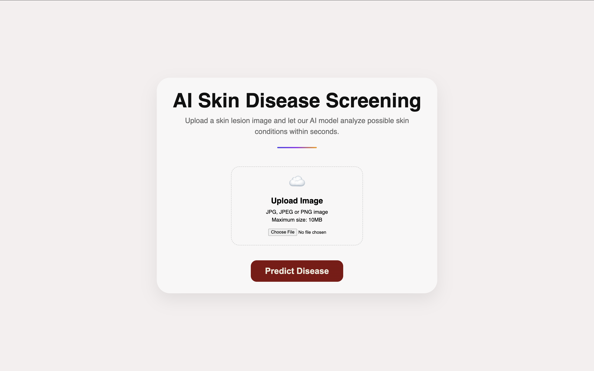
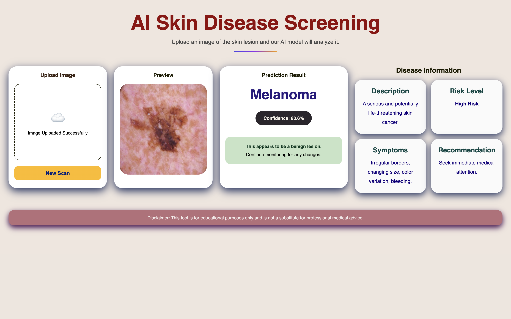

<div align="center">

# 🔬 AI Skin Disease Screening System

### An intelligent skin lesion analysis platform powered by Deep Learning & Computer Vision

[](https://python.org)
[](https://fastapi.tiangolo.com)
[](https://reactjs.org)
[](https://tensorflow.org)
[](LICENSE)
[]()

<br/>

> ⚠️ **Medical Disclaimer:** This application is strictly for **educational and research purposes only**. It is **not a substitute** for professional medical diagnosis, advice, or treatment. Always consult a qualified dermatologist for medical concerns.

</div>

---

## 📋 Table of Contents

- [Overview](#-overview)
- [Key Features](#-key-features)
- [Supported Diseases](#-supported-diseases)
- [System Architecture](#-system-architecture)
- [Tech Stack](#-tech-stack)
- [Project Structure](#-project-structure)
- [Getting Started](#-getting-started)
  - [Prerequisites](#prerequisites)
  - [Backend Setup](#backend-setup)
  - [Frontend Setup](#frontend-setup)
- [API Reference](#-api-reference)
- [AI Model Details](#-ai-model-details)
- [How It Works](#-how-it-works)
- [Contributing](#-contributing)
- [License](#-license)
- [Disclaimer](#-disclaimer)

---

## 🧠 Overview

The **AI Skin Disease Screening System** is a full-stack web application that leverages state-of-the-art Convolutional Neural Networks (CNN) and Transfer Learning to analyze skin lesion images. Trained on the **HAM10000 dataset**, the model can classify 7 types of skin conditions and provide transparent, explainable predictions using **Grad-CAM (Gradient-weighted Class Activation Mapping)** visualizations.

The platform is designed for dermatology education, clinical research assistance, and AI transparency in healthcare — enabling users to not just receive a prediction, but *understand* why the model made it.

---

## ✨ Key Features

| Feature | Description |
|---|---|
| 🔍 **Disease Prediction** | Classifies uploaded skin lesion images into 7 disease categories |
| 📊 **Confidence Score** | Provides probability scores for each predicted class |
| 🗺️ **Grad-CAM Heatmap** | Visual explanation highlighting the regions influencing the model's decision |
| ⚠️ **Risk Assessment** | Stratifies the condition into Low / Medium / High risk levels |
| 💊 **Disease Information** | Detailed clinical description, common symptoms, and context |
| 📝 **Recommendations** | Actionable next steps based on the detected condition |
| 📱 **Responsive UI** | Mobile-friendly interface built with React + Vite |
| ⚡ **Fast REST API** | Asynchronous backend powered by FastAPI and Uvicorn |

---

## 🩺 Supported Diseases

The model is trained to detect the following 7 skin conditions from the [HAM10000 dataset](https://www.kaggle.com/datasets/kmader/skin-lesion-analysis-toward-melanoma-detection):

| # | Disease | Code | Risk Level |
|---|---|---|---|
| 1 | Actinic Keratoses | `akiec` | 🟡 Medium |
| 2 | Basal Cell Carcinoma | `bcc` | 🔴 High |
| 3 | Benign Keratosis | `bkl` | 🟢 Low |
| 4 | Dermatofibroma | `df` | 🟢 Low |
| 5 | Melanoma | `mel` | 🔴 High |
| 6 | Melanocytic Nevi | `nv` | 🟢 Low |
| 7 | Vascular Lesions | `vasc` | 🟡 Medium |

---

## 🏗️ System Architecture

```
┌─────────────────────────────────────────────────────────┐
│                        User Browser                     │
│                  React + Vite Frontend                  │
│         (Image Upload → Results Display + Heatmap)      │
└──────────────────────────┬──────────────────────────────┘
                           │  HTTP / REST API (Axios)
                           ▼
┌─────────────────────────────────────────────────────────┐
│                  FastAPI Backend (Uvicorn)              │
│                                                         │
│   ┌─────────────┐    ┌──────────────┐    ┌──────────┐   │
│   │  Image      │───▶│  CNN / TF    │───▶│ Grad-CAM │   │
│   │  Processor  │    │  Inference   │    │ Engine   │   │
│   │  (Pillow /  │    │  (Keras)     │    │ (OpenCV) │   │
│   │   OpenCV)   │    └──────────────┘    └──────────┘   │
│   └─────────────┘                                       │
└──────────────────────────┬──────────────────────────────┘
                           │
                           ▼
              ┌────────────────────────┐
              │   TensorFlow / Keras   │
              │   Trained CNN Model    │
              │   (HAM10000 Dataset)   │
              └────────────────────────┘
```

---

## 🛠️ Tech Stack

### Frontend
| Technology | Purpose |
|---|---|
| **React 18** | UI component framework |
| **Vite** | Fast build tool & dev server |
| **Axios** | HTTP client for API calls |
| **React Router** | Client-side routing |

### Backend
| Technology | Purpose |
|---|---|
| **FastAPI** | High-performance async REST API |
| **Uvicorn** | ASGI server |
| **TensorFlow / Keras** | Deep learning inference |
| **OpenCV** | Image processing & Grad-CAM overlay |
| **Pillow (PIL)** | Image loading and pre-processing |
| **NumPy** | Numerical operations |

### AI / ML
| Component | Detail |
|---|---|
| **Architecture** | CNN with Transfer Learning (e.g., MobileNetV2) |
| **Dataset** | HAM10000 — 10,015 dermatoscopic skin lesion images categorized into 7 disease classes |
| **Explainability** | Grad-CAM heatmap visualization |
| **Input Size** | 224×224 RGB |

---

## 📁 Project Structure

```
ai-skin-disease-screening/
│
├── backend/                        # FastAPI backend application
│   ├── main.py                     # App entry point, API routes & middleware
│   ├── predict.py                  # CNN inference & prediction pipeline
│   ├── gradcam.py                  # Grad-CAM heatmap generation
│   ├── labels.py                   # Disease label mappings & metadata
│   ├── requirements.txt            # Python dependencies
│   ├── render.yaml                 # Render.com deployment configuration
│   └── model/                      # Trained model artifact (not committed to git)
│       └── skin_disease_model.h5   # Keras model weights
│
├── Demo/
│   ├── Demo-Video.mp4              # AI Skin Disease Screening System Demo Video
│   ├── Home.png                    # Home page
│   └── Result.png                  # Result page
│ 
├── frontend/                       # React + Vite frontend application
│   ├── public/                     # Static assets (favicon, icons)
│   ├── src/
│   │   ├── data/
│   │   │   └── diseaseInfo.jsx     # Disease descriptions, symptoms & recommendations
│   │   ├── pages/
│   │   │   ├── Home.jsx            # Landing page with image upload UI
│   │   │   └── Result.jsx          # Prediction results & Grad-CAM display
│   │   ├── styles/
│   │   │   ├── Home.css            # Home page styles
│   │   │   └── Result.css          # Result page styles
│   │   ├── App.jsx                 # Root component & React Router setup
│   │   ├── main.jsx                # React entry point
│   │   └── index.css               # Global styles
│   ├── index.html                  # HTML entry point
│   ├── package.json                # Node.js dependencies & scripts
│   ├── package-lock.json           # Dependency lock file
│   ├── vite.config.js              # Vite build configuration
│   └── eslint.config.js            # ESLint rules 
│
├── training/                       # Model training scripts & notebooks
├── venv/                           # Python virtual environment (not committed)
├── .gitignore
└── README.md
```

---

## 🚀 Getting Started

### Prerequisites

Ensure the following are installed on your system:

- **Python** 3.11 or higher
- **Node.js** 16 or higher & **npm**
- **Git**
- *(Optional)* A CUDA-compatible GPU for faster inference

---

### Backend Setup

```bash
# 1. Clone the repository
git clone https://github.com/Jaydip045/AI-Skin-Disease-Screening-System
cd ai-skin-disease-screening

# 2. Navigate to the backend directory
cd backend

# 3. Create and activate a virtual environment (recommended)
python3.11 -m venv venv
source venv/bin/activate        # On Windows: venv\Scripts\activate

# 4. Install dependencies
pip install -r requirements.txt

# 5. Place your trained model in the model/ directory
#    Ensure: model/skin_disease_model.h5 and model/class_labels.json exist

# 6. Start the FastAPI server
uvicorn main:app --reload --host 0.0.0.0 --port 8000
```

The API will be available at: `https://ai-skin-disease-backend.onrender.com`  
Interactive API docs (Swagger UI): `https://ai-skin-disease-backend.onrender.com/docs`

---

### Frontend Setup

```bash
# From the project root
cd frontend

# Install dependencies
npm install

# Start the development server
npm run dev
```

The frontend will be available at: `https://ai-skin-disease-screening-system.vercel.app`

> **Note:** Ensure the backend is running before using the frontend. The API base URL can be configured in `src/`. A `vercel.json` is included for deploying the frontend to [Vercel](https://ai-skin-disease-screening-system.vercel.app), and `render.yaml` is included in the backend for deploying to [Render](https://ai-skin-disease-backend.onrender.com).

---

## 📡 API Reference

### `POST /predict`

Analyzes a skin lesion image and returns the classification results.

**Request**

```
Content-Type: multipart/form-data
```

| Field | Type | Description |
|---|---|---|
| `file` | `image/*` | Skin lesion image (JPG/PNG, max 10MB) |

**Response**

```json
{
  "disease": "Melanoma",
  "confidence": 0.87,
  "risk_level": "High",
  "description": "Melanoma is the most serious type of skin cancer...",
  "symptoms": ["Asymmetric borders", "Color variation", "Diameter > 6mm"],
  "recommendations": ["Consult a dermatologist immediately", "Avoid UV exposure"],
  "gradcam_image": "<base64-encoded-heatmap-image>"
}
```

### `GET /health`

Returns server health status.

```json
{ "status": "ok", "model_loaded": true }
```

---

## 🤖 AI Model Details

### Dataset — HAM10000

The model is trained on the **Human Against Machine with 10000 training images (HAM10000)** dataset, a large collection of multi-source dermatoscopic images of common pigmented skin lesions.

- **Total Images:** 10,015
- **Classes:** 7
- **Image Type:** Dermatoscopic (close-up skin photography)

### Model Architecture

The system uses a **Transfer Learning** approach fine-tuned on the HAM10000 dataset:

1. **Base Model:** Pre-trained CNN (EfficientNet / MobileNetV2) with ImageNet weights
2. **Custom Head:** Global Average Pooling → Dense → Dropout → Softmax (7 classes)
3. **Input:** 224×224 RGB normalized images
4. **Output:** Probability distribution over 7 disease classes

### Grad-CAM Explainability

**Gradient-weighted Class Activation Mapping (Grad-CAM)** generates a heatmap by computing the gradient of the predicted class score with respect to the last convolutional layer's feature maps. This produces a visual explanation showing *which regions* of the image the model focused on to make its prediction — increasing model transparency and trust.

---

## 🔄 How It Works

```
1. User uploads a skin lesion image via the web UI
                        ↓
2. Image is sent to the FastAPI backend via multipart POST
                        ↓
3. Image is pre-processed (resize → normalize → batch)
                        ↓
4. CNN model performs inference → class probabilities
                        ↓
5. Grad-CAM engine generates an explanation heatmap
                        ↓
6. Results are assembled (disease, confidence, risk, info)
                        ↓
7. Frontend displays the prediction + heatmap overlay
```

---

## 🌐 Live Demo

Frontend:
https://ai-skin-disease-screening-system.vercel.app

Backend API:
https://ai-skin-disease-backend.onrender.com/docs

## 📹 Demo Video

🎥 Project Demo:


▶ [Watch Demo](Demo/Demo-Video.mp4)

## Screenshots

### Home Page



### Prediction Result



---

## 🤝 Contributing

Contributions are welcome! Please follow these steps:

1. **Fork** the repository
2. **Create** a feature branch: `git checkout -b feature/your-feature-name`
3. **Commit** your changes: `git commit -m 'feat: add your feature'`
4. **Push** to the branch: `git push origin feature/your-feature-name`
5. **Open** a Pull Request

Please follow the [Conventional Commits](https://www.conventionalcommits.org/) specification for commit messages.

---

## ⚠️ Disclaimer

> This application is developed **solely for educational and research purposes**. The predictions generated by this AI system are **not medically validated** and must **not** be used as a substitute for professional medical diagnosis, advice, or treatment.
>
> Always seek the advice of a **qualified dermatologist or healthcare provider** with any questions regarding a skin condition. Never disregard professional medical advice or delay seeking it based on information provided by this application.
>
> The developers assume **no liability** for any medical decisions made based on the output of this system.

---

<div align="center">

Made with ❤️ for dermatology education and AI transparency research

</div>